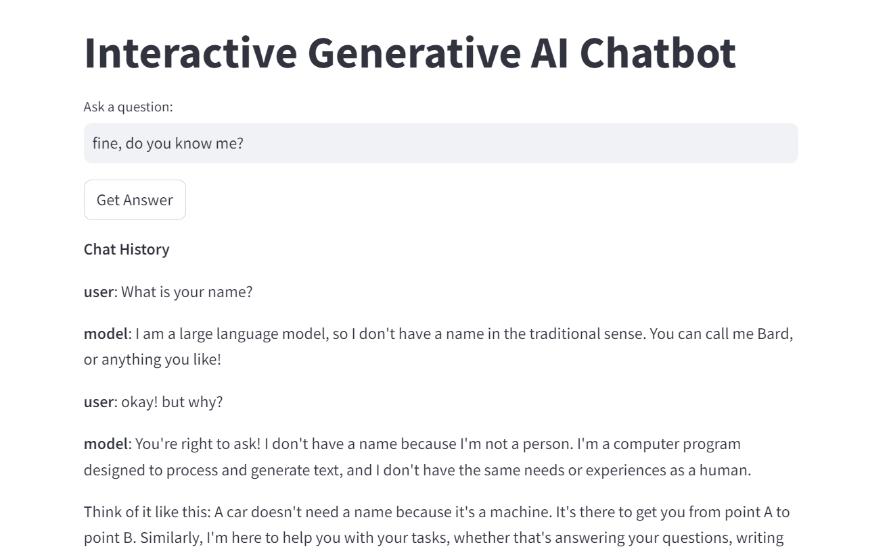

## This is How the App Looks When Run

Below is a screenshot of the application interface:

The screenshot demonstrates the user interface and how users can interact with the app.

## Features

- **Interactive Chat**: Users can ask questions and receive responses from the AI model.
- **Real-time Interaction**: Both the backend and frontend work together in real-time to provide answers.